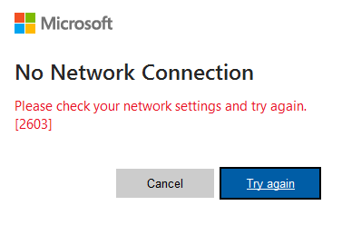

# New Outlook desktop client: errors with additional Email account

## Problem description

I switched to the new Outlook client some time ago. When I did, I had two M365 accounts configured in Outlook.
The second one I hardly use.

However, I noticed recently that the second account wasn't working anymore.

When trying to access this one, I got the following error at sign-in:

`No network connection. Please check your network settings and try again [2603]`



## Troubleshooting

My network connection is fine, and my other M365 account is sending an receiving Emails properly. 

I have tried restarting the app and removing and adding the Microsoft 365 account again, but I received the same error.

## Solution

I had a look and found a multiple .nst and .ost files related to the second account in C:\Users\<myusername>\AppData\Local\Microsoft\Outlook\ that I removed.

- `<user>@<domain>.<suffix>.nst`
- `<user>@<domain>.<suffix>.ost`
- `<user>@<domain>.<suffix>(2).nst`
- `<user>@<domain>.<suffix>(3).nst`
- `<user>@<domain>.<suffix>(4).nst`
- `<user>@<domain>.<suffix>(5).nst`

I also removed the following files from `C:\Users\<username>\AppData\Local\Microsoft\Outlook\16\`

- `AutoD.<user>@<domain>.<suffix>.xml`
- `OPXConfig.<user>@<domain>.<suffix>.json`
- `OutlookConfig.<user>@<domain>.<suffix>.json`

I used the following PowerShell one-liner to remove these files

```powershell
Get-ChildItem -Path C:\Users\<username>\AppData\Local\Microsoft\Outlook\ -Recurse -Force | Where-Object Name -Match '<domainname>' | Remove-Item -Force -Verbose
```

After that I started Outlook again and was able to add the second M365 account without any errors.
